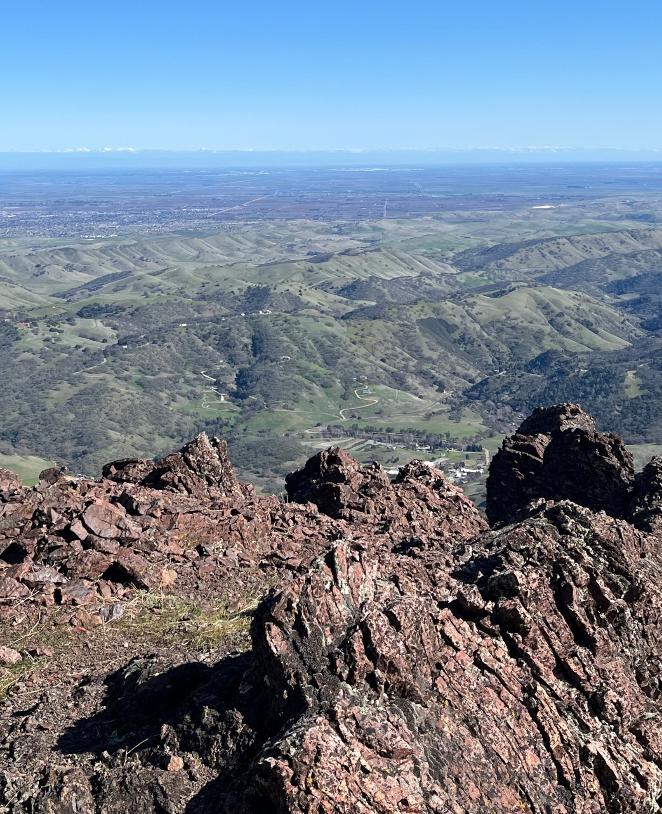

**Distance**: 27.5 miles
**Elevation**: +5450 -5100 feet
**Running time**: 5 hours 20 minutes
**Transit time**: 2 hours 20 minutes
**Fare**: $14.40
[View on GaiaGPS →](https://www.gaiagps.com/public/ERVLNUMzf2Ae5PJSy8PHcem1/)

I've developed somewhat of a Super Bowl tradition. After trying to get into the spirit of the day via other approaches, I've found that a distressingly long run really puts me in the right state of mind to properly enjoy an afternoon of football, just as soon as I figure out who's playing.

I've been sticking to routes closer to home though, so I wasn't sure where to go. It's tricky to keep finding new BART-accessible trail routes that aren't overly contrived and that feel worthwhile relative to the effort it takes to get there. In the spirit of expanding boundaries then, I decided to explore new territory at the end of the Antioch BART line.

My objective was to start in Antioch, run through Black Diamond Mines and Clayton Ranch Regional Preserves, then run up the North Peak of Mount Diablo (the smaller of the two peaks of Mount Diablo) and work my way back home.

It didn't quite go according to plan, but I was saved by GaiaGPS and robust Bay Area trail infrastructure.

## 12th Street Oakland

My day started at 8:11 AM as I caught the first Antioch-bound BART of the day. I would much prefer to leave at 4:30 AM and catch sunrise on top of a hill, but the trains run when the trains run.

## Orinda

## Lafayette

## Walnut Creek

The BART line gives you plenty of time to stare at Mount Diablo and contemplate the day ahead.

## Concord

## North Concord

## Bay Point

## Bay Point transfer station

Past Bay Point, you must to transfer to a smaller train before continuing to Antioch. There was no wait, and the train is quite pleasant.

## Pittsburg

## Antioch

The run started at about 9:15 AM. I intentionally packed quite light, carrying just a water bottle, a hand bottle, and a few energy gels. I popped into a gas station to grab a quick Gatorade and a Clif bar.

Leaving Downtown Oakland for suburbia feels like stepping into a parallel, slightly softer universe.

## Contra Loma Regional Park

## Black Diamond Mines Regional Preserve

I was excited to enter the first real park of the day. [Black Diamond Mines Regional Preserve](https://www.ebparks.org/sites/default/files/BlackDiamondMines-2024-12.pdf) is three things. First, it's the ancestral homeland of the Ompin, Volvon, and Julpun tribes, second it was 19th century coal mining territory, and today it's an 8,533 acre park. The hills are modest, and I hoped this meant the running would be easier.

The reservoir was buzzing with mid-morning foot traffic. The hills were quiet though, and cows quickly replaced people.

The cows sauntered out of the way as I spoke politely to them and approached slowly.

Cresting the hill, the North Peak of Mount Diablo stands 3,556 feet tall just over the next line of hills.

An expansive valley to the south was the best view of the day.

The bare hills and cow-trampled pasture give way to red sandstone and dense brush. I wasn't moving quickly, but things were easy and smooth at this point.

## ⛔️ Clayton Ranch Regional Preserve ⛔️

A snag. My route planning was based on the Public and Private land use layers of GaiaGPS. Clayton Ranch Regional Preserve (above, red polygon) is a 4,200-acre patchwork of acquired land belonging to [East Bay Regional Park District](https://www.ebparks.org/parks). I hoped that as public land it would be accessible, but my planned route through it (red line) was unambiguously closed to foot traffic. After a couple attempts to find an alternate route, I settled on the appropriately-named Black Diamond to Mount Diablo Regional Trail (blue line).

The connector trail is surrounded on all sides by private land, but it saved me from having to bail to Pittsburg. 

The price of this detour was a four-mile stretch on the highway which I'd hoped to avoid.

## Mount Diablo State Park

Mercifully, Mount Diablo State Park abuts the highway, and there's a perfectly pleasant trail that allows you to skip the last mile along the road.

Finally, the main focus of the day loomed above. The Diabolical Trail is a two mile trail that averages about 27% grade (!) as it ascends 2,900 feet from the valley to the North Peak of Mount Diablo. 🔥🦵🔥

Eighteen miles into the run, my legs were not fresh.

On a clear day, you can see about 90 miles east to snow-capped peaks of the Sierras.

The summit of the North Peak marked the division between the nice part of the day's run and _the rest of it_.

## Prospector's Gap

In my younger years, I'd have made quick run up to the main peak of Mount Diablo, but I focused on just getting home in once piece.

The eastern slopes were warming in the midday sun, so I was surprised to see north-facing ridge trail still lined with frost.

By 23 miles, plantar fasciitis set in, and what should have been a victorious descent down the final ridge was a heavy slog down the hill.

The road to Clayton extends into the distance. My attention began to fixate on weekend bus schedules.

I spent the last two miles of the run fighting the Apple Maps interface, trying to get it to refresh both my current position and the time remaining before arrival of the bus.

## County Connector 310

The bus runs every 40 minutes on weekends, so I was very pleased to wait only about five minutes.

## Concord

After another brief wait for the BART, I rested my legs and enjoyed the ride home.

Already a distant memory.

Whoever printed these stickers to perfectly cover the "DO NOT hold doors" signs on the BART, you have a big fan here.

## 12th Street Oakland

And that's that. The route turned out alright, but my persistent plantar fasciitis has made these runs less fun than they used to be. It doesn't kick in until about 20 miles, so you could look at it as karma, either for undertaking these runs at all or for failing to keep up with my assigned calf-raises. With everything going on in the present world though, I have the ability to get outside for a trail run, so painful or not, so I can't complain.

I was a bit disappointed by the detour. I looked up Clayton Ranch Regional Preserve and wasn't quickly able to find out that it was definitely open or definitely closed to the public. I appreciate that GaiaGPS is a tool and not a crowd-sourced source of truth and certainly don't feel that it misled. I just wish that it were a bit easier to find more direct information about trail conditions without having to cross-reference maps with every web search link you can click.

At any rate though, I'm content with this route. If I'd taken a book to read on the train and cut off the Mount Diablo section, this would have been quite a nice, runnable fourteen-mile route. I would definitely _either_ do this run in the winter when the heat is forgiving _or_ drive to the trail so that I could start earlier than 9:00 AM though.

Super Bowl was great. Dog loved it. I ate some chips, pizza, and half the veggie platter. Until next time. 👋

Go team! 🎉

[← Back]()
