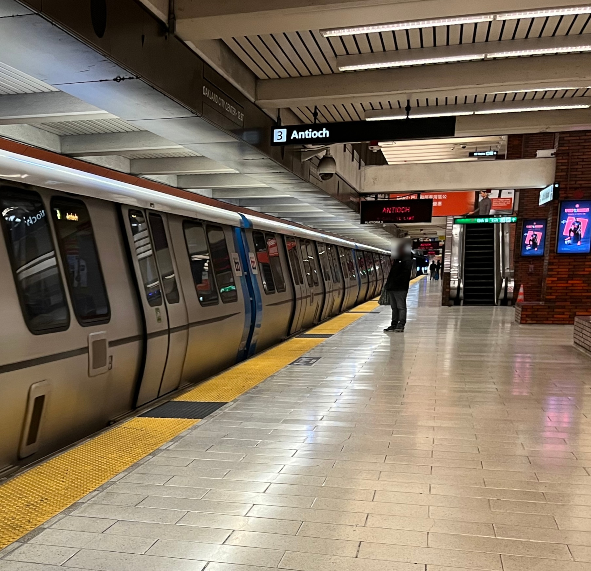
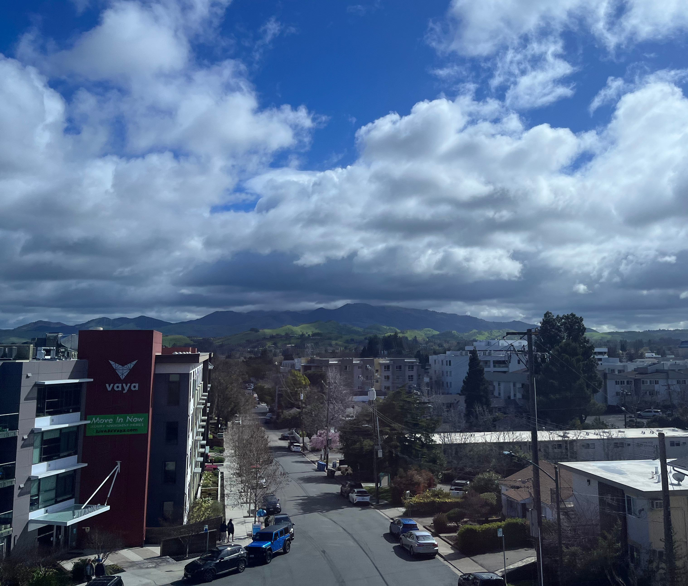
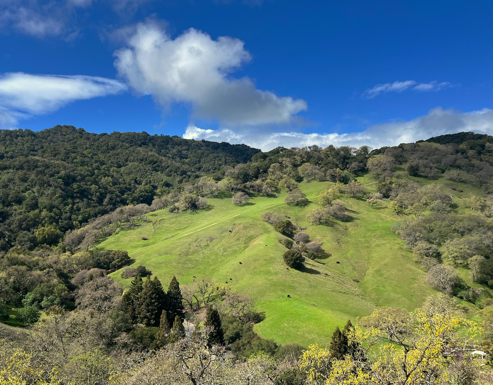
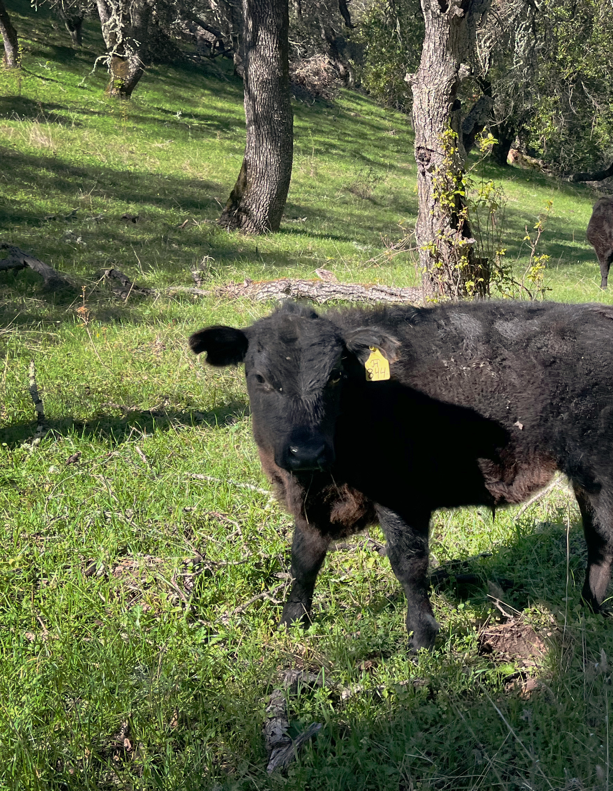
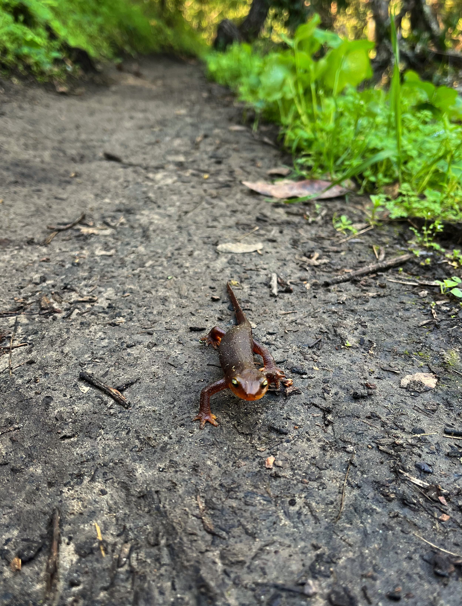
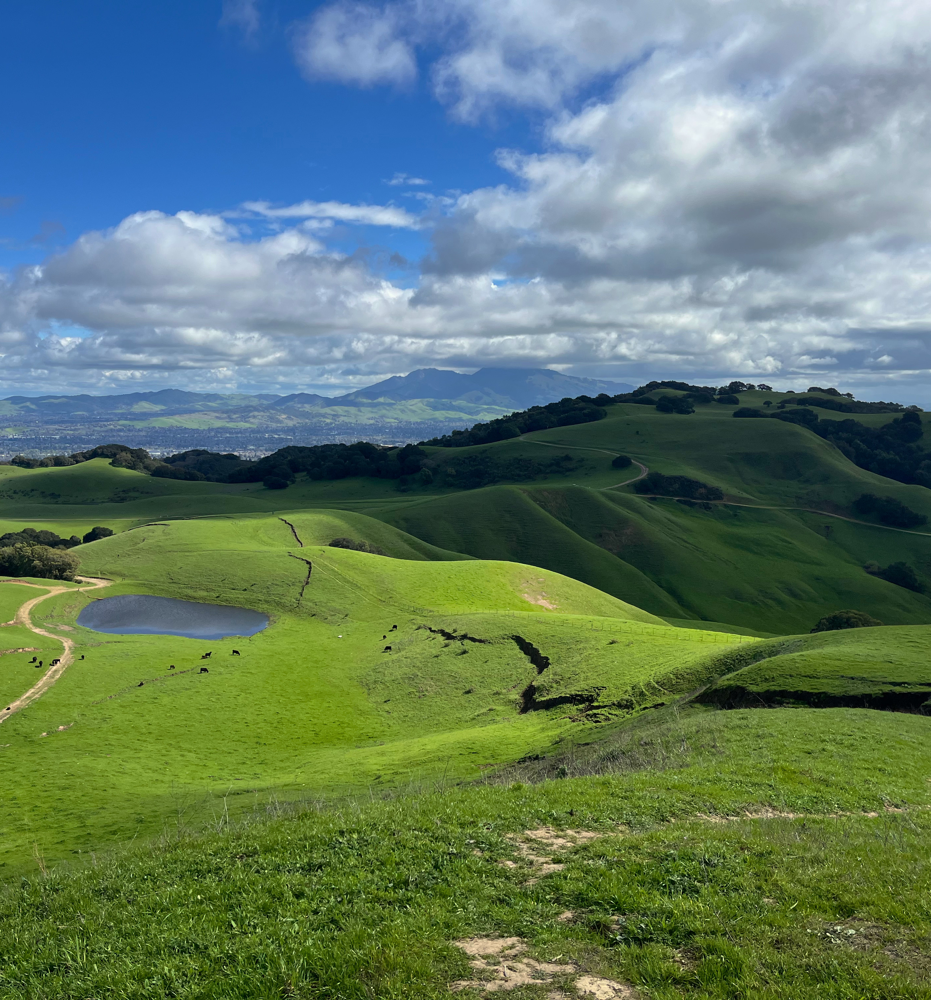
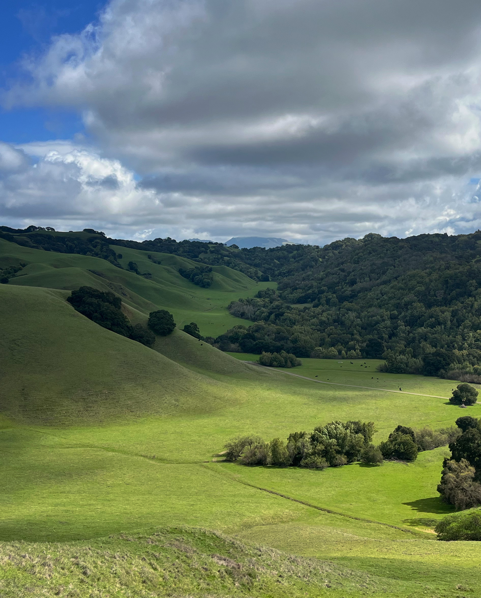
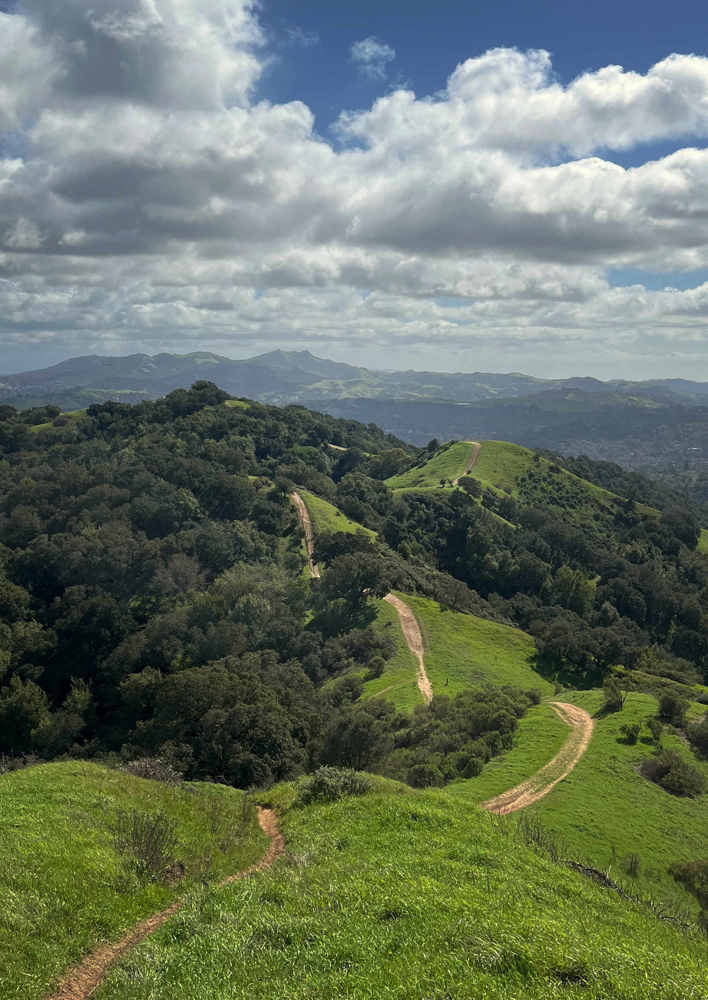
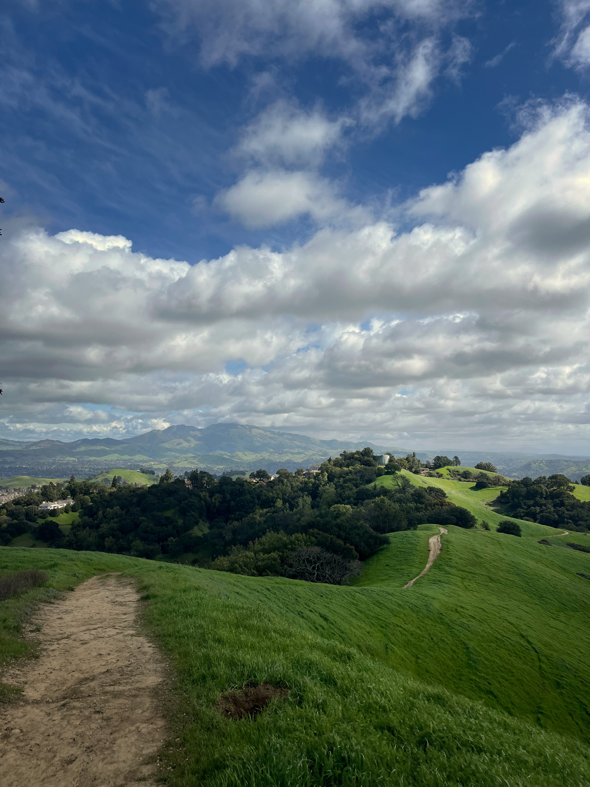
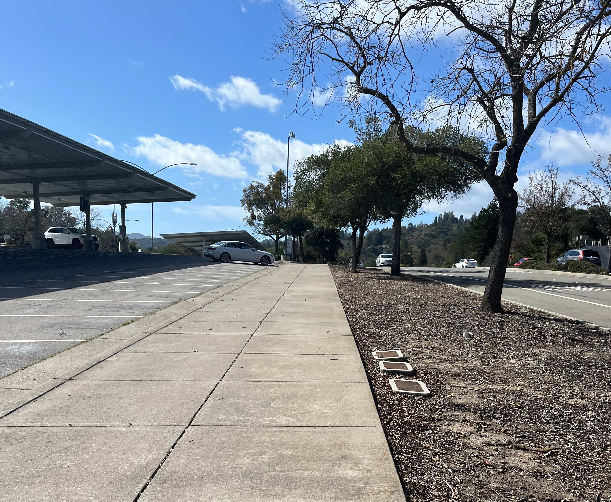

**Distance**: 14.2 miles
**Elevation**: +2,350 -2,080 feet
**Running time**: 2 hours 17 minutes
**Transit time**: 52 minutes
**Fare**: $8.25
[View on GaiaGPS →](https://www.gaiagps.com/public/udrowHChMPo0ikBkUFjpusYo/)

After a pretty strenuous run the previous weekend, my energy level crashed by mid-week and I didn't even manage to run two miles home from the gym without stopping to walk. So by the weekend, I was pretty eager to get outside, but maybe only for something relaxing.

I've figured out alright by now how to do completely unreasonably long runs via the BART, but It's a feature of the spread-out BART lines that there aren't many stations you can connect with a relatively modest trail run. The De Laveaga trail from Orinda to Berkeley is one of the few that works out very well.

So in my push to cover more territory on the blog, I decided the day had arrived to try Briones Regional Park. I've run through it just once before, and it was… great. Stopping to think about it, I couldn't figured out why I hadn't returned.

I mapped out a route for about a half marathon, allowing for some creating routefinding along the way, grabbed a water bottle and a couple energy gels, and headed out the door.

## 12th Street Oakland

I arrived at the BART station at about 10:31 AM, just as the train was rolling into the station. I was trying my best to get to the station before the train arrived, although I didn't think it'd be quite that close.

Mount Diablo, shrouded in clouds. Bigger adversaries for bigger days.

## Pleasant Hill / Contra Costa Centre

I started the run right at 11:00 AM. Since I only had a single water bottle for the day, I stopped at the Shell Station and grabbed a Gatorade, drinking it as quickly as I could to fight an ice cream headache.

The gas station attendant was entertained that I first couldn't figure out the locked display-only case, then couldn't find my way into the kiosk where the real Gatorade awaited.

Pleasant Hill is an excellent place to start a run. Compared to the Concord BART station which is surrounded by miles of stop lights and shopping malls, Pleasant Hill pretty quickly dumps you into quiet, almost rural neighborhoods. Five stars; would run again.

## Briones Regional Park

I arrived at the 6,117-acre [Briones Regional Park](https://www.ebparks.org/parks/briones) trailhead thinking I'd run not more than two miles, but it was closer to 3.5. A good sign.

A significant portion of the park is just cow pasture, but the hills offer Bay Area incredible views that were so oversaturated in the California late rainy season that they hardly looked real.

This was the second run in a row with squishable wildlife nearly underfoot. I saw maybe fifteen or twenty newts, which was tolerable considering I've previously seen so many in [Tilden Regional Park](https://www.ebparks.org/parks/tilden) that I've bailed entirely on more than one run during their November through March breeding season.

As soon as you exit the forest, it turns into some real Windows XP wallpaper level vistas.

The real winner of the day turned out to be the trails listed on GaiaGPS as "Unmaintained Trail." I've had bad luck getting too creative in other parks where unmaintained trails quickly fade into nothingness, leaving me crawling through brush and scrambling down embankments. In Briones though, they were all just exceptional single-track paths through forests and over hills.

If not for precisely this view, which I've seen only once before, I'd have run the day in the opposite direction. I wanted to save the best for last.

I could have run the ridge until the bitter end, but I'd have had to turn around and run back on the road anyway. All good things come to an end.

The final stretch on the main road, along the BART Park 'n Ride lot, is a bit unceremonious, but it was less than a mile.

## Lafayette

I caught the Oakland-bound Lafayette train with about a seven minute wait. The wait was tolerable, but the chilly breeze really tested me.

## 12th Street Oakland

I couldn't have been happier with the day and with the run. I spent less than an hour in transit, and at any rate I listened to an audiobook of the Kurt Gödel biography, [Journey to the Edge of Reason](https://wwnorton.com/books/9781324005445), so I could have spent longer on the train.

Briones Regional Park is maybe about 3 &times; 3 miles if you had to shoehorn it into a square. It's not huge, but there's a lot to explore. A surprising amount of the park has sweeping views in every direction.

I won't overdo the praise since "best trail I've run in X area" is becoming a bit of a Trains and Trails cliche. The only thing I'll add is that if you see only one section, I'd aim for the southeast section of the park. The Ridge Trail out of Lafayette is convenient and *stunning*.

I don't know why my mind was stuck on Briones Regional Park not being convenient or not being quite the right distance, but it was both, and I plan to return soon.

[← Back]()
