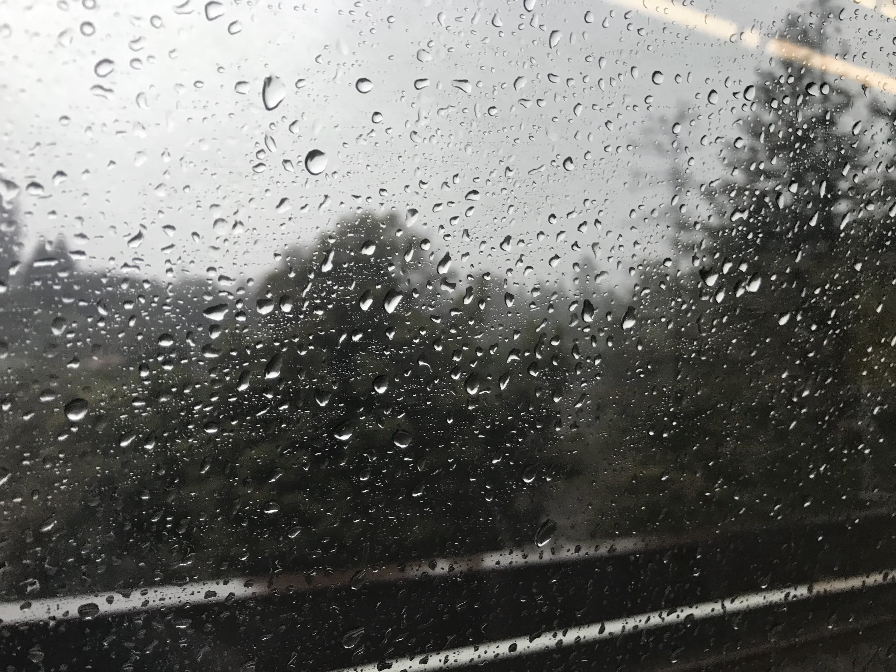
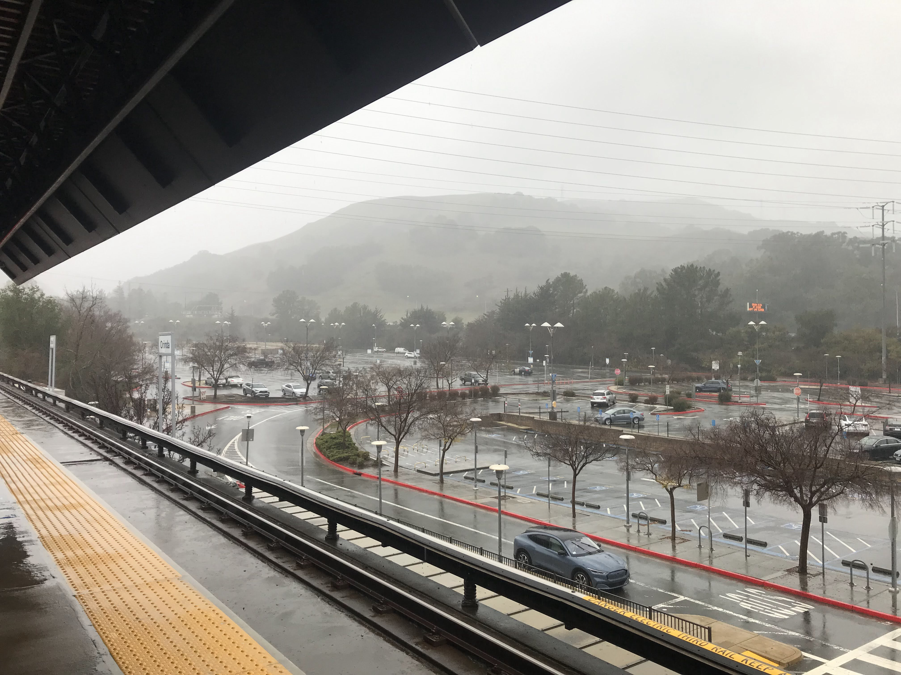
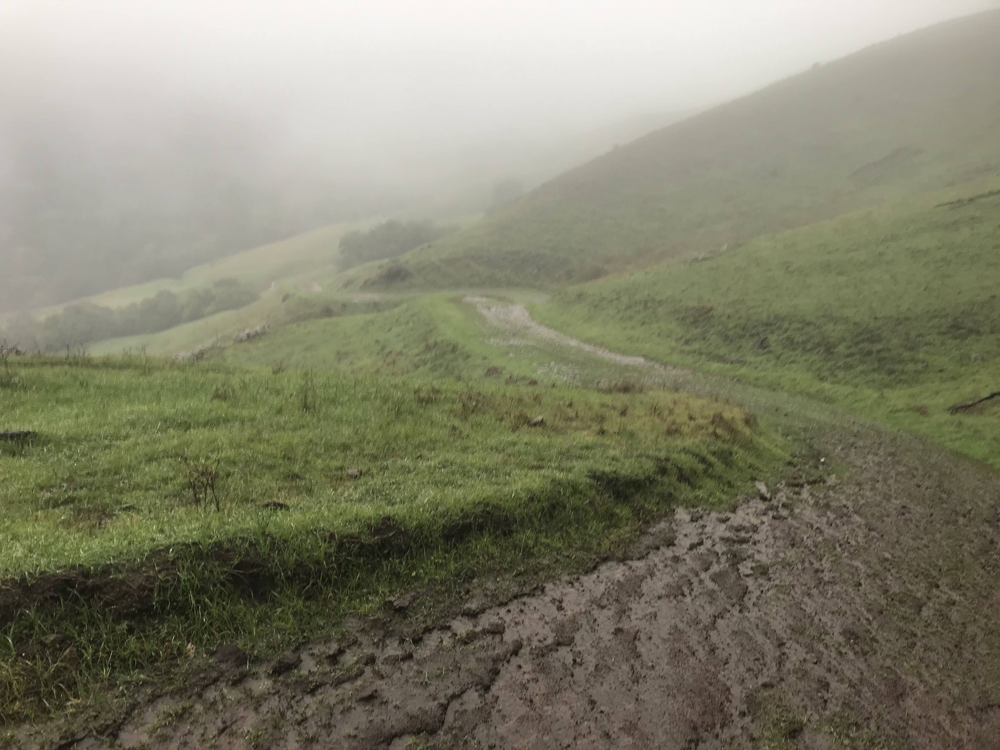
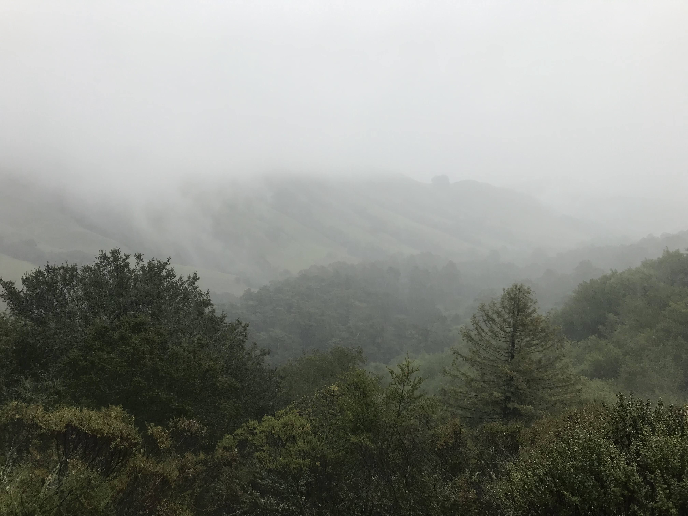
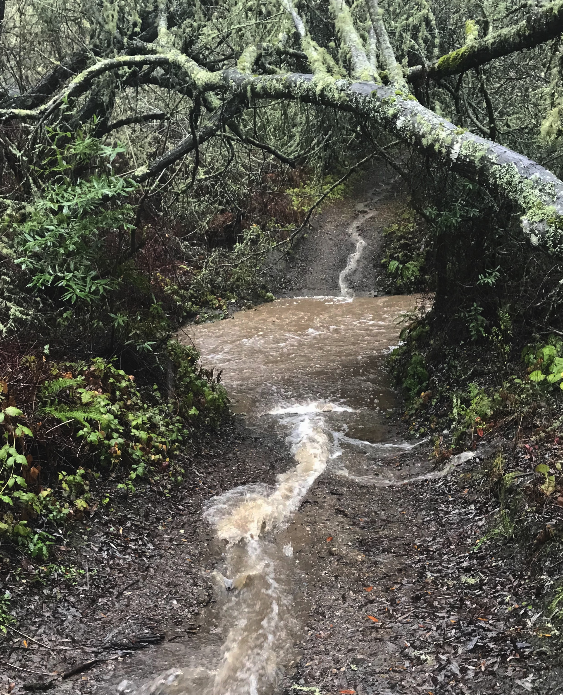
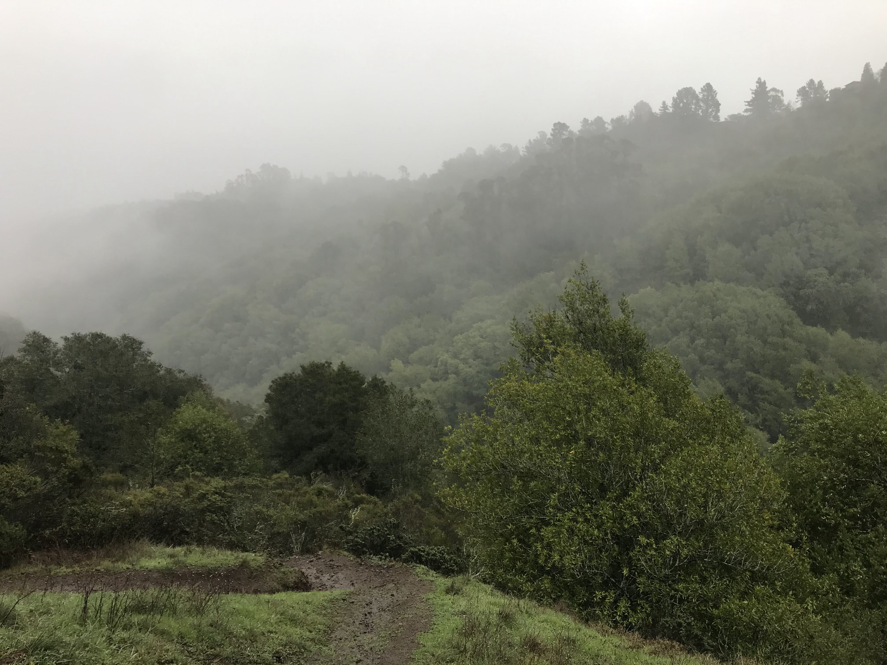
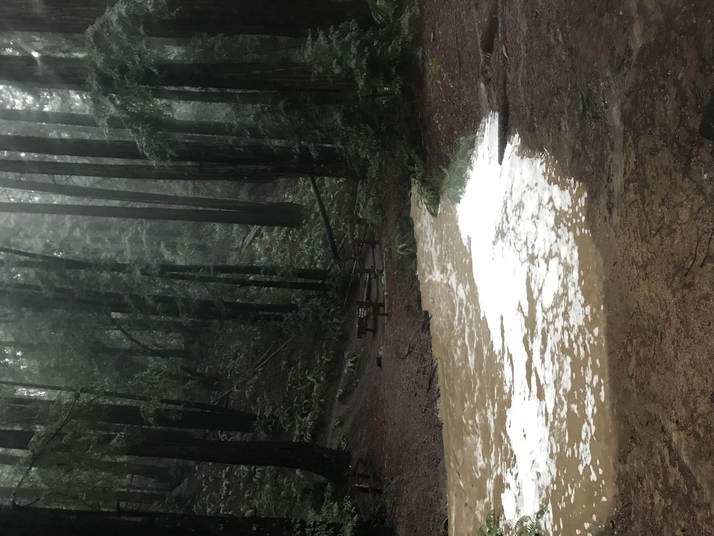
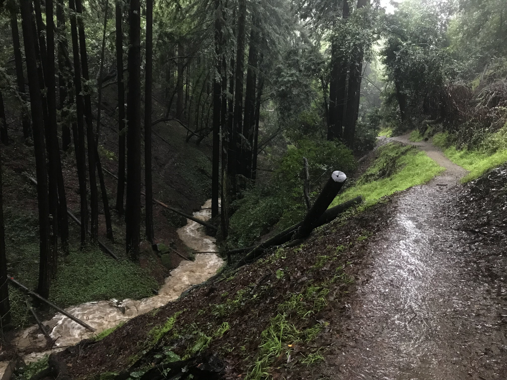
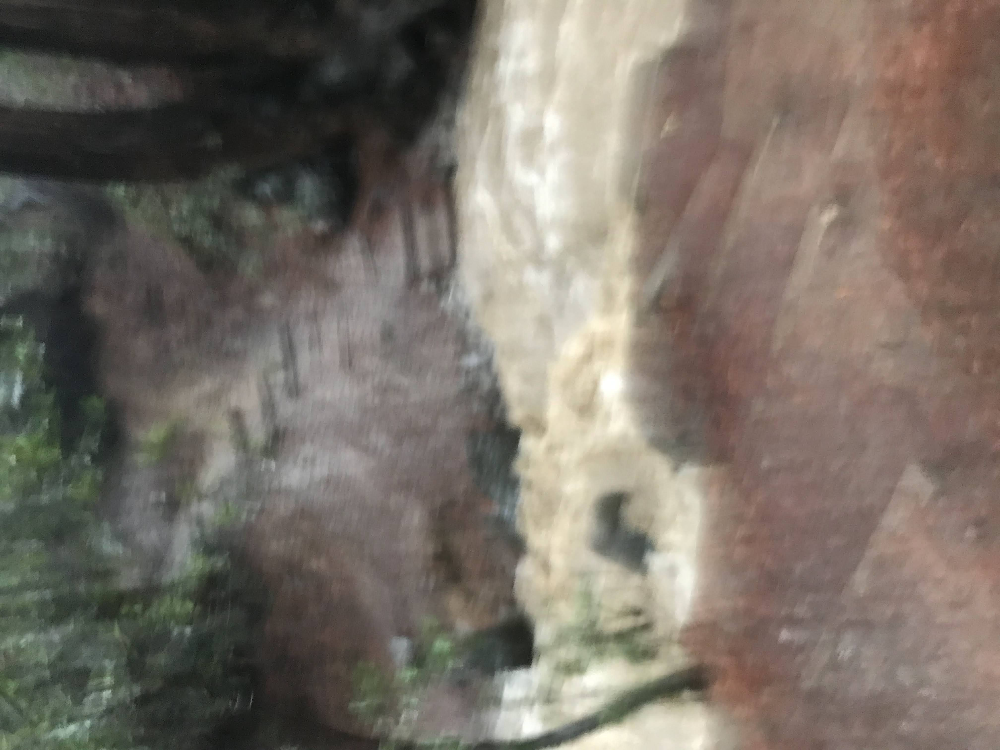

**Distance**: 19.0 miles
**Elevation**: +2900 -3340 feet
**Running time**: 3 hours 2 minutes
**Transit time**: 14 minutes
**Transit fare**: $2.70
[View on GaiaGPS →](https://www.gaiagps.com/public/rDq3kMu8McTz1XjO3pArR4zU)

"You should run early today," suggested my wife this morning. I looked out the window at the rain. "I'll… run later…" A common refrain these days. "But you like the rain." I knew she was right, and however tepid my enthusiasm, it turned out to be a memorable run.

My Midwestern friends are skeptical when I tell them it generally only rains in the Bay Area only [once or twice](https://weatherspark.com/h/s/541/2022/3/Historical-Weather-Winter-2022-in-Oakland-California-United-States#Figures-Rainfall) from late spring through autumn. At the time of writing, [precipitation in Oakland](https://www.cnrfc.noaa.gov/awipsProducts/RNORR4RSA.php) this season has been relatively average, currently about 118% of the season-to-date total.

For anyone who appreciates mild, sunny weather, this means the Bay Area is a monotonously wonderful place to live. For those of us who prefer rain though, this means you have to make hay while the sun doesn't shine… (To seize the day? Is that better?)

One of the best parts of East Bay is the abundance of parks, but it's only recently that I've started to figure out how to link them up, an approach which is certainly easier when you're not forced by a car to return to your starting point. So I decided today to brave the rain and link up as many parks as a single water bottle and a couple energy gels would permit, then see if I could catch the bus home (spoiler: I didn't).

## 12th Street Oakland

I started by heading out the door and catching the Antioch-bound BART line to Orinda.

To be honest, it was raining somewhat harder than I had thought, but motivation—or a lack thereof—ceases to remain a factor once you're well past the point of no return.

## Orinda

It's typically all business and I'm that eager runner who jogs up and down BART escalators. But I wasn't in a hurry today and spent a moment admiring the hills from the comfortable shelter of the BART station.

## De Laveaga Trail

The [De Laveaga Trail](de-laveaga/) is—I assert—one of East Bay's finest trails. I don't know if it's the terrain itself or if it's perhaps a psychological consequence of the fact that it used to require a special trail pass to access, but even though it's cow pasture dotted with power lines, something about it feels _real_. At any rate, the run gets going quickly with an immediate thousand foot ascent.

An early photo shows the trail descending across the hills. I double-Ziploc-bagged my phone, but every time I stopped to snap a picture, my hands were slightly colder and more saturated with water, my phone a bit wetter, and the touchscreen more difficult to operate.

The trails were soft, which made it at times difficult just to get up the hill without sliding back down. Pictured here is one of the relatively drier sections of trail, as a sizeable portion today was just running water.

Still, even if it wasn't fast running, the steady white noise of rain and rushing water made for one of the most meditative runs I've had on these trails.

Looking across the valley to catch the best view of the De Laveaga Trail as the hills fade away into the fog.

## Sibley Volcanic Regional Preserve

Shortly after crossing over the Caldecott Tunnel, the trail meets up with [Sibley Volcanic Regional Preserve](https://www.ebparks.org/parks/sibley-volcanic). We once found two domesticated rabbits which had been let loose near the parking lot, which we rescued and named Sibley and Huckleberry. (The last report is that they're happy and healthy and we now have a rabbit of our own!) The upper loop makes for an excellent early morning loop, but knowing I still had a long run ahead, I opted to take the more direct forested route through Sibley.

The first major obstacle of the run came as a surprise, as I had no idea there was a creek here which _could_ overflow. After some deliberation, it was clear that there was no alternative but to step carefully straight through it. Fortunately, it was only knee-deep.

## Huckleberrry Botanic Regional Preserve

[Huckleberry Botanic Regional Preserve](https://www.ebparks.org/parks/huckleberry) is situated awkardly, crossing a deep gully and serving primarily to connect adjacent larger parks. Despite it's modest size, the deep valley and lush growth make it a completely worthwhile destination in its own right, especially on the sunniest of days when it still refuses to give up its dark and mysterious feel.

I expected the rain to fluctuate, so I was actually a little surprised by now to find that it hadn't let up. The sound of footsteps, raindrops, and rushing water was hypnotic.

## Reinhardt Redwood Regional Park

_The_ East Bay park. [Renamed in 2019](https://www.ebparks.org/about-us/whats-new/news/redwood-regional-park-renamed-after-first-female-park-district-board-member) after Dr. Aurelia Henry Reinhardt, one of the five original board members of the East Bay Regional Parks District. [Redwood Regional](https://www.ebparks.org/parks/reinhardt-redwood) can hardly be topped, either in quality or quantity of trails.

As the rain still hadn't let up, I began to grow just a bit worried about flooded creeks. General advice is [not to cross a creek deeper than your knees](https://thethousandmiler.com/how-to-cross-water-safely/), and after just some wet feet from previous crossings, it looked like this one was set to exceed that threshold. Downstream a few feet, the water was significantly faster and the ditch deeper—but jumpable. Checking now, I see that the main entrance is closed due to flooding and rock slides.

After crossing successfully, I added an extra loop on the Tres Sendas Trail. Two additional creek crossings proved only slightly less exciting than the above.

## Joaquin Miller Park

Penultimate on the list was [Joaquin Miller Park](https://www.oaklandca.gov/topics/joaquin-miller-park). A common mountain biking destination, the hills which descend through redwoods and eucalyptus back to the city never disappoint. I wasn't thrilled about that today though, as descents mean valleys, and valleys mean water.

After hardly seeing anyone for the first ten miles, I finally started to see a few brave souls (dogs included) out for a hike. "Isn't this the best??" asked a random passerby. I heartily agreed.

Just a few feet farther along though, I encountered one of the trickiest crossings yet, tinged with the faint smell of a sewer. Left with few options and no desire to backtrack and seek an alternate park exit, I planted one foot firmly, stepped onto a tree stump, and jumped the remaining span.

## Dimond Canyon Park

I mean the running throughout was great, but as the run proceeded and the rain persisted, I became increasingly focused on the next creek crossing. Dimond Canyon cuts deep, so I opted to exit the park rather than proceed across a raging river. Pictured here is therefore the final crossing of today's run. I managed to cross by scrambling around an upstream tree and stepping across on a fallen log.

Though I didn't want the run to end, my tolerance for creek crossings was, at last, exhausted. Looking down into the gully, I was surprised by the intensity and volume of the roaring water. It was time to exit.

Crossing the valley on the paved bridge above, I had expected at this point to catch the AC Transit 33 bus back to Downtown Oakland. On a weekend and a holiday no less, I didn't very much feel like standing in the rain for as much as thirty minutes just to avoid a gently sloping return to the city.

The run down Park Boulevard isn't scenic, but it goes by quickly, making it a pretty reasonable fallback when you're not eager to wait for the bus.

## 12th Street Oakland

I don't want to overstate how exciting this run was and go calling a little run on local city trails "epic" or something, but this really was an uniquely memorable run. It has thoroughly reinforced my determination to ignore the lazy voice in the back of my head and stop saying "I'll run… later."

And hopefully not lost in the rain is just how pleased I am with the route. Even though I didn't end up catching the bus home, it would have cut this route down to fifteen miles. Cutting off a couple loops would further reduced it to perhaps twelve or so. Good conditions would have made the running faster, and suddenly you're down into pretty reasonable afternoon run range!

[Back]()
