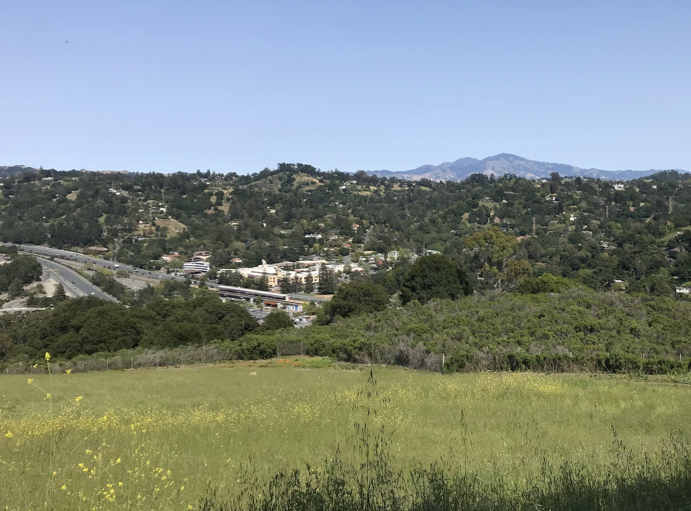

[7.35 miles](https://www.gaiagps.com/datasummary/track/6330342820b20aa00b80150ade4e545e/?layer=GaiaTopoRasterFeet)

Immediately rising a thousand feet as it leaves Orinda, the [De Laveaga Trail](https://www.ebmud.com/recreation/east-bay/east-bay-trails) gains another five hundred feet as it cuts across the East Bay Hills, then meets Tilden Regional Park and descends back down into Berkeley. Paired with the excellent accessibility and modest distance, the constantly-rolling hills make it plenty of a challenge and, all things considered, my number one choice for a weekday trail run.

## 12th Street Oakland

We start from the 12th Street Oakland BART station. It's rare that I have to wait the maximum twenty or thirty minutes for the next train, but if I've learned one lesson on this project, it's nevertheless to check the BART schedule on weekends!

From Oakland, Orinda is an easy 15-minute BART ride. During the above-ground portion, I like to preview the weather by watching the hills through the window.

## Orinda

From the Orinda BART station, it's only a quarter of a mile to the De Laveaga trailhead. It doesn't get much more convenient than that, though it requires a brief run along a sidewalk-free highway to get there.

The trail immediately rises a thousand feet as it starts back westward, giving a birds-eye view of the Orinda BART station with Mount Diablo beckoning in the background. On clear days, I like to convince myself that you can just barely catch a glimpse of the distant snow-capped Sierras.

The top of the ridge is a welcome arrival, though the running doesn't get much easier from here.

I've often found myself driving along a highway, looking longingly out the window at the rolling hills, imagining I could find myself running among them. The moment I saw the De Laveaga trail, I realized _these are the hills I look out the window and long for_. Which is ironic then, because although it's one of the most beautiful vistas in the area, the constant ups and downs prevent the running from flowing easily.

Eucalyptus groves are [moderately invasive](https://www.kqed.org/news/11644927/eucalyptus-how-californias-most-hated-tree-took-root-2), but it's impossible not to appreciate the smell.

The trail across the top of the ridge is quite rutted. It's a small reminder the natural state of these trails doesn't involve the sort of foot traffic they see. Sadly, it looks like [East Bay trail maintenance projects](https://www.ebparks.org/trail-maintenance-volunteers) are still on hold due to COVID.

At last, we're treated with a view of San Francisco and the Golden Gate Bridge as we start the descent down into Berkeley. Photos of this view never convey the expanse and depth.

We catch the Berkeley Fire Trail admire the view of Strawberry Canyon, [LBNL](https://www.lbl.gov/), and UC Berkeley as we descend the nice, wide path down to the stadium.

To run through or to read a book upon, Berkeley's campus deserves more than the brief, goal-oriented traversal we give it here.

## Downtown Berkeley

If we played our cards right, we now wait between one and twenty minutes to catch the BART back home. Fortunately, you can check the displays and, if you didn't time it right, enjoy a few more minutes of fresh air.

## 12th Street Oakland

For all that the route offers, the distance is pretty modest, totalling just eight miles. Whether you hike or run, I can hardly recommend this route highly enough.

[Back]()
