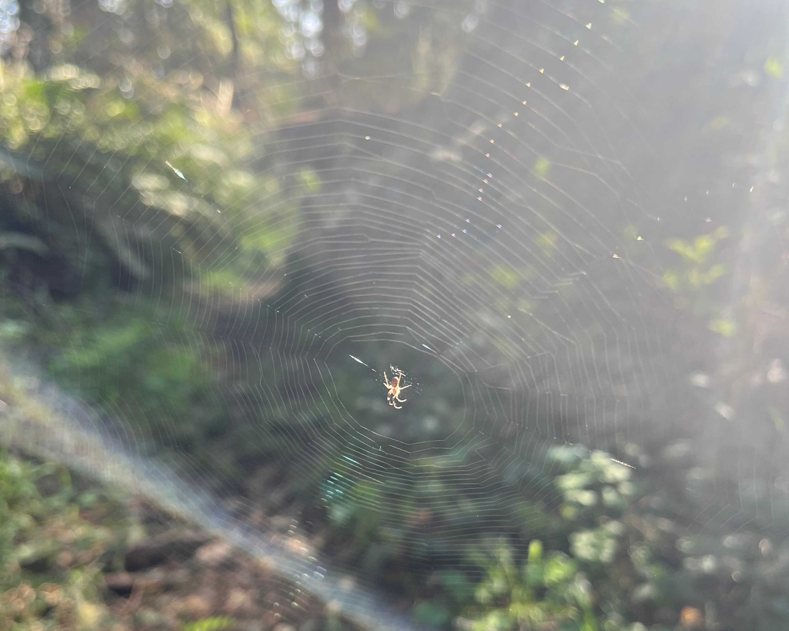
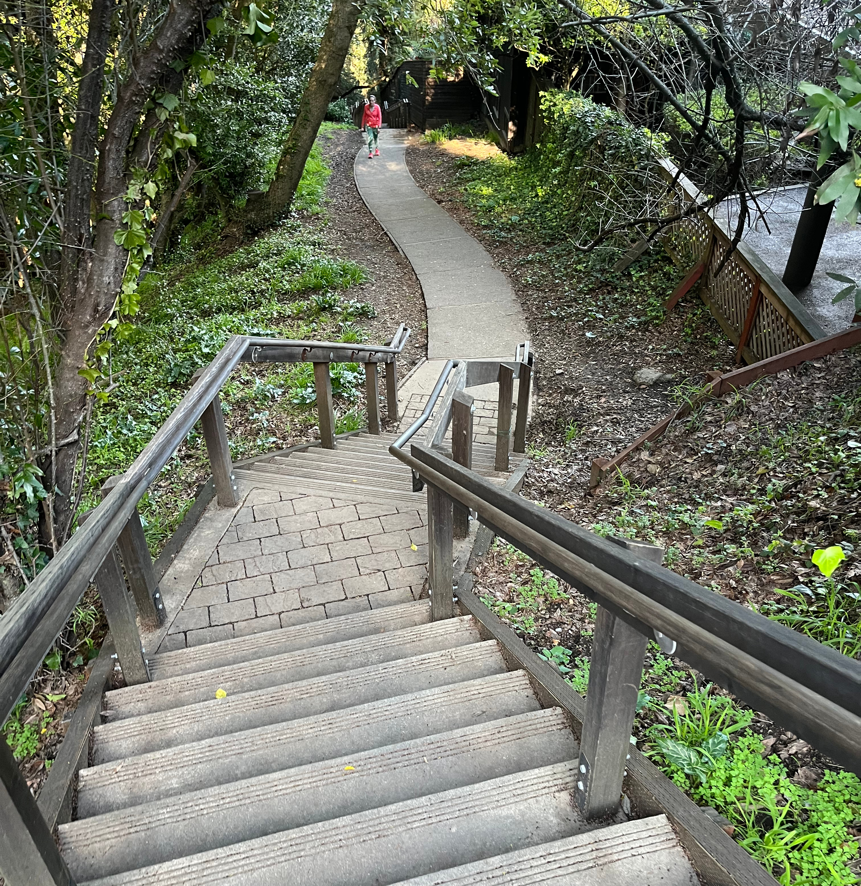

**Distance**: 40.5 miles
**Elevation**: +7270 -7430 feet
**Running time**: 7 hours 53 minutes
**Transit time**: 4 hours 30 minutes
**Fare**: $24.80
[View on GaiaGPS →](https://www.gaiagps.com/public/8GIVq1Y4Rjwp1c9GzjIn6J2h/)

Lagunitas has always struck me as the perfect place to start a run. Close enough to be accessible by bus, and just on the less-traveled side of all the popular places to run.

So I had a starting point planned out, but this run suffered—or thrived, perhaps—from a lack of further planning. My only real plan was to take the bus to Lagunitas and see where my heart took me. The minimal route I planned was to immediately climb Shafter Grade out of Lagunitas to gain Bolinas Ridge, then follow the ridge 10 miles back to Stinson Beach and see about catching a bus.

My planned route would have made for a stunning and pleasant 15 mile run, but I couldn't shake the fear that I just wouldn't bother coming all the way back out to Lagunitas any time soon. I had enough food and water (two front water bottles, a hand bottle, and a 18 ounce waist belt), so I figured I'd just see how it went and get creative along the way.

## 12th Street Oakland

I arrived at the bus station at about 5:03 AM. The first time I've ever arrived at the station before it's open! I caught the Richmond-bound train at 5:11 AM.

## El Cerrito del Norte: 580 Bus to San Rafael

I only waited a couple minutes at El Cerrito del Norte for the first bus transfer.

Almost everyone on the bus at 5:45 AM was presumably headed to work. I didn't feel badly out of place, but I'm very aware that it's a huge privilege to head out for a full-weekday run without a second thought, just because the idea popped into my head.

## San Rafael: 68 Bus to Lagunitas

I waited about 25 minutes for the 580 bus to Lagunitas where I'd start my run. It worked out quite well since it gave me time to fuel up at a gas station with Haribo gummy bears and a Gatorade.

I was sad to be missing the sunrise, but it was the best scenery I've seen from a city bus.

## Lagunitas

The bus driver was friendly and let me off at the closest approach to Lagunitas since the bus doesn't quite make it there first thing in the morning. He suggested to take the bus to Inverness near Point Reyes next time, like the cyclists do.

The road had absolutely no shoulder at a couple points, which had me jumping out of the way against a fence and then crossing the road. Just a short jaunt on the road though.

## Shafter Grade

I turned onto the Shafter Grade and was off of paved roads for the rest of the day. The trail doesn't mess around as it gently ascends about 1,100 feet to the Bolinas Ridge Trail, which then runs all the way back along the ridge to Stinson Beach. My hands hurt from the cold air in Lagunitas, so I was anxious to get some blood flowing.

## Bolinas Ridge Trail

The Bolinas ridge gently undulates for about fifteen miles from Point Reyes Station all way back to Stinson Beach. Compared to the chilly valley, the air on top of the ridge was perfectly mild and dry.

## Randall Trail

I wanted pretty badly to cut the day short and run a simple, pleasant 15 mile day to Stinson Beach, but I opted to *carpe* the *diem* and divert toward Point Reyes.

Every time I rounded a corner, I was met with another side trail where people had cut the switchbacks. I had no desire to cut this near-ideal running short, so I stayed on the main trail and ran a few extra feet.

## Point Reyes National Seashore

The valley was unpleasant. The air was humid and the sun was already getting intense.

I turned onto the trail that would take me right back up onto Bolinas Ridge. Running out to the ocean seemed nice though, so I second-guessed myself and decided to see what Philip Burton Wilderness Area was about.

## Philip Burton Wilderness Area

## Bolema Trail

[Philip Burton Wilderness Area](https://www.nps.gov/pore/learn/wilderness.htm) is about a 30,000-acre subset of Point Reyes National Seashore. Although it's not terribly remote, it certainly feels like it. The redwood-lined trails are perfectly fine to run on but not overly maintained. It's easy to run for miles at a time without encountering either a person or even a junction in the trail.

I was pretty excited to round a corner and discover that I could see out to the ocean for the first time of the day.

## Coast Trail

## Point Reyes Bird Observatory

As… opposed to… the rest of the trails?

The Nature Trail Turned out to be a lovely, tiny little nature trail though.

## Ridge Trail

The Ridge Trail cut halfway back up through the wilderness area, after which I'd descend again before ascending back up to Bolinas Ridge. Fortunately, the slugs kept my mind off of the hills and intently focused on stepping around every slug-shaped piece of bark.

## Teixeira Trail

The Teixeira Trail started out wonderfully.

It became less and less maintained though, which I kinda liked. I stepped with some effort over the spider web, and at a full six foot jump to the ground, this is the largest log I've ever jumped over.

## McCurdy Trail

So do I recommend visiting Philip Burton Wilderness Area? What I will say is that the trails don't really seem to *go* any place I'd call absolutely worth visiting, so if the experience itself of running for miles along forested trails without seeing many people appeals to you, then you have your answer.

I guess the ridges are ridges because they're rocky and don't erode. The exposed rock and low brush caught me off guard though, becuase I was hoping for shade.

## Bolinas Ridge Trail (continued)

I was happy to be back on the ridge. It's easily one of my favorite places I've run. I didn't take any pictures for a while. Maybe got a little philosophical. From the time that I left the ocean back at mile 14, the only people I saw until reaching mile 28 and Mount Tam State Park were two mountain bikers.

## Coastal Trail

I mean… what even *is* life?

## Mount Tamalpais State Park

I won't do the Coastal Trail above Stinson Beach an injustice by trying too hard to describe it. It's impossibly beautiful to look down 1,700 feet, above the redwood trees, onto the ocean below.

## Matt Davis Trail

The Matt Davis Trail to Stinson Beach is a wonderful 1,600 foot victory descent after running the larger portion of Bolinas Ridge.

There were quite a few hikers heading up and down. Usually I like some company, but it was hard to get into it after the preceeding five hours of solitude.

## Stinson Beach

I figured from the start that I'd wing it, but arriving in Stinson Beach at 1:20 PM, I didn't expect that the bus to Marin City wouldn't depart until 3:20 PM! I figured I could still run a [Dipsea](https://www.dipsea.org/) in less than two hours and be well on my way home before the bus even departed Stinson Beach.

## Dipsea Trail

Normally I'd maybe be a little into it, but the Dipsea is a seven mile trail famous for its stairs, hills, and [race](https://www.dipsea.org/), and I mostly just wanted to get home.

Had its moments.

## Mill Valley

Looked like I was definitely going to miss the bus by just a couple minutes as I descended the many staircases into Mill Valley, but the bus was also four minutes late. I had a chance.

## 17 Bus to San Rafael

I was pretty thrilled to wait only one or two minutes and hop on the bus back to San Rafael.

## San Rafael: 580X Bus to El Cerrito del Norte

Google suggested I'd have to wait 30 minutes for the 580 bus back to El Cerrito del Norte, but I only had to wait another couple minutes for the 580X express. This was good, because after a few minutes of sitting down, it was getting surprisingly unpleasant to stand and walk around.

## El Cerrito del Norte

I was a little impatient with an eight minute wait at the BART station, but I could manage it.

## 12th Street Oakland

This seems easily like the best Bay Area run I've done. I could have played my cards a little differently reduce the intensity of the day, but a surprising amount of the running was shaded, and the hills weren't so intense that they turned it into a real suffer-fest.

So let's break it down.

Lagunitas is an incredible place to start a run! It's easily accessible by bus, and in just over three miles, you can be on top of Bolinas Ridge.

Bolinas Ridge is mostly shaded and gently rolling. The humid air and midday sun were significantly less intense than in the valleys or near the ocean. I measure that you could run about fifteen miles to Stinson Beach or about 17.5, shortcutting most of the Dipsea, straight back to Mill Valley. Either would amount to one of the best trail runs I could imagine anywhere, much less within spitting distance of the Bay Area.

Stinson Beach sits just below one of the best, most scenic areas I've visited, and it could be an alright place to catch a bus after running, but the buses don't run very often, so you'd need to plan carefully.

And the Dipsea is a seven mile trail that you can run. If you want.

What a day. By the end, this one hurt a moderate amount, more than most, but I'm counting it as a big success.

[← Back]()
