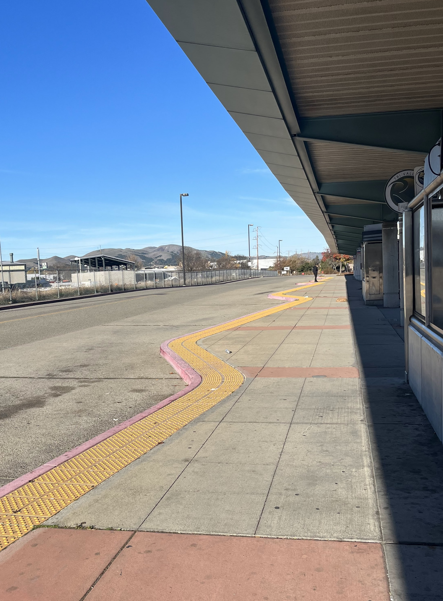

**Distance**: 44.7 miles
**Elevation**: +7438 -7847 feet
**Running time**: 8 hours 37 minutes
**Transit time**: 2 hours 10 minutes
**Transit fare**: $4.90 + bus transfer + $5.40 = $10.30
[View on GaiaGPS →](https://www.gaiagps.com/public/w6tnBZEZzYqkgbiSJVRfrPGV/)

I've wanted to run the Ohlone Wilderness Trail through [Ohlone Wilderness Regional Preserve](https://www.ebparks.org/parks/ohlone) for years now. Shortly after arriving in the Bay Area, we hiked [twelve miles out and back](https://www.alltrails.com/trail/us/california/murietta-falls-trail) from Lake Del Valle to Murietta Falls. It was about the sunniest and most idyllic meadows I've wandered around in, but the elevation gain is significant and it was intimidating to appreciate that we'd hardly even scratched the surface of the trail system.

And so the Ohlone Trail has remained on my to-do list for a number of reasons. First is the nature of the trail itself. The Ohlone Trail starts at [Lake Del Valle](https://www.ebparks.org/parks/del-valle) and spans about 27 miles, passing through [Ohlone Wilderness Regional Preserve](https://www.ebparks.org/parks/ohlone) and [Sunol Wilderness Regional Preserve](https://www.ebparks.org/parks/sunol) before traversing [Misson Peak Regional Preserve](https://www.ebparks.org/parks/mission-peak) and ending in Fremont. The trail is very committing, with essentially no option to bail except to complete the first twenty miles to Sunol (at which point hopefully you were able to convince a friend to come to your rescue) or to go back the way you came. (Fortunately, cell service was actually much better than I expected.)

Additional factors contributed. Sunol was closed for a good share of 2023 due to damage resulting from the unusually rainy season, and even when open, it's a far better trail in the winter due to high summertime temperatures and sun exposure. And finally, it requires a [trail permit](https://www.ebparks.org/rentals-and-permits/permits/ohlone-wilderness) which although it only took five minutes to order—and is by a wide margin the nicest trail permit I've ever received—this small hurdle was enough to prevent an impulse decision once or twice.

This time was different though. I had my trail pass and I had a date. A Tuesday, when the buses run a bit earlier, so that I could get as early a start as possible. But I got impatient on a Saturday morning at 8:30 AM, so I threw it all to the wind, grabbed my stuff, and ran out the door to make it happen.

## Lake Merritt Station

Despite having learned to plan ahead on weekends, once the impulse decision had been made, I grabbed everything I thought I'd need, ran for the Lake Merritt BART Station without checking the schedule, and fortunately only had to wait about two minutes for the next train.

I almost certainly carried too much, but knowing any real mishap would likely have me spending the night outside, I came prepared.

- 1 backpack with small Camelbak bladder and two 18 oz water bottles 
- 1 waist belt with 24 oz water bottle
- 2 28 oz bottles Gatorade
- 1 18 oz hand bottle
- 10 energy gels
- ACR ResQLink 400 Personal Locator Beacon
- Backup phone battery
- Lightweight jacket
- Trail pass/map + sharpie
- Hat, sunglasses, buff

Along the way, I reviewed the map. When I received my trail pass in the mail, I opened up a detailed topographic map and was surprised to realize that the map, with date stamped in the corner, *is* the trail pass—which you are required to have with you at all times. There's a saying, "Safety rules are written in blood." It means they don't institute safety rules until something goes badly wrong. So I hope nothing too unfortunate had to happen for [EBRPD](https://www.ebparks.org/) to take what feels like an unusually heavy-handed approach with the pass, but at any rate, I was pretty happy with the result.

## Dublin/Pleasanton Station

## 10R Bus to Livermore

The twenty minute wait for the 10R bus to Livermore wasn't too bad, and there was even a bathroom at the station—which, when you're stuck at a bus stop trying to overhydrate in preparation for a long day outside, is a big plus.

## Livermore

I hopped off the bus at the point of closest approach to Lake Del Valle and began the day right at 10:00 AM. Given the scale of the day, it was, to say the least, an inadvisably late start.

I figured if I could average 5 miles per hour and the route came out to 45 miles, that would put me at about 9 hours and a finishing time of 7:00 PM. It would be dark, but not problematically so. Naturally it was at this point I realized I'd forgotton my headlamp.

The bike path was quite nice and allowed to skip running along any busy roads.

Slightly nervous about bonking in the middle of a wilderness area, I slammed the Gatorade I'd been carrying and stopped by a gas station for a replacement Gatorade, a Clif Bar, and a bag of Lay's potato chips.

## Sycamore Grove Park

Sycamore Grove Park is a lovely, flat, open park. It was nice to see so many people, many of them perhaps getting an active start to their winter break, out walking and biking with their families.

I had a hard time finding my intended route, but the trails seemed to go the same direction as they forked all over the plain.

## Del Valle Regional Park

One big fear was that I'd burn precious time and miles on wrong turns or dead-end trails on private land. I had a bad feeling as I scrambled down a six foot vertical embankment to a brushy river bed below, but the trail got me where I needed to go.

I felt more at home as I finally started to gain some elevation.

Del Valle is an outstanding and scenic trail run. It's a bit of a drive to get there, but a trail wraps around the north side of the lake for at least seven miles. Out and back, that's more than enough for a nice, quiet long run.

The running was quite good, but the rolling hills weren't as easy or brief as I expected.

## Ohlone Wilderness Regional Preserve

The smooth running stopped immediately as soon as I stepped onto the Ohlone Trail. I grew a bit nervous, as sixteen miles is a long way to run just to find yourself stepping onto the *beginning* of a marathon-length trail.

The scenery was lovely though, and the near-solstice sun angle was very forgiving.

It was nice to see a few of the only people I'd see all day, but it was moderately discouraging to descend 500 feet into a valley, just to immediately ascend the other side.

The photos don't do it justice, and it's hard to put into words just how pleasant the top of the ridge is. It feels like the sort of place where you spread out a picnic blanket, pull a book out of your backpack, and then just stare at the clouds for a few hours.

As I approached the southeast corner of the route, it felt like a big accomplishment—even if I was only halfway done—to turn the corner and start heading back west toward San Francisco Bay.

I slowly watched my average pace drop throughout the day from 7.5 miles per hour, down to 6 miles per hour, and then into the fives. In this region though, the running flowed and I felt like I was able to at least prevent it from dropping further.

After ascending the previous valley, I was painfully well aware I had probably not less than twenty miles remaining. If I'd known Rose Peak would be the high point of the entire day, I wouldn't have skipped the summit, but alas, I skirted around it, cutting off an extra one or two hundred feet of elevation gain.

Another selfie, this time with the glossy finish mostly worn off.

Miles of rolling hills unfolded into the distance with Mission Peak (rightmost peak just touching the horizon) visible on the horizon.

A mile later, Mission Peak seemed not even slightly closer.

## Sunol Regional Wilderness Preserve

At this point the trail switched to single track, as it would remain for most of the remaining descent to the Sunol staging area.

I was somewhat disappointed that a ten mile rolling descent with stunning views could actually feel so unpleasant, but the previous thirty miles of running and ten pounds of gear and water had taken their toll. My brain was happy, but my legs were not.

I was encouraged looking back east, hoping that a waxing gibbous moon would substitute for a forgotten headlamp.

I stopped at the Sunol staging area and sat on a picnic table for at least five minutes. I ate the rest of my potato chips and Clif bar, knowing the final ascent up Mission Peak would require all the potato chips I could throw at it.

The views briefly got better and better as the sun set.

With some food and gatorade in me, my spirits finally lifted. The back side of Mission Peak was surprisingly gradual and runnable.

Looking back east, Livermore was little more than a glow of lights on the horizon.

The light faded as I crested Misson Peak and the lights of the Bay Area came into view. A small tree with lights stood near the summit.

Disappointingly, my legs preferred climbing at this point, so that the descent from Misson Peak was not nearly as pleasant as usual.

## Warm Springs/South Fremont Station

I waited for only a matter of seconds before the train pulled into the station.

## 12th Street Oakland

All in all, the Ohlone Wilderness Trail was every bit as stunning as I hoped it would be. I was ever so slightly disappointed that the wide trails and cow fences made it feel more like cow pasture than any sort of wilderness, but given that it's hardly even a short hop away from the Bay Area, I'm certainly not complaining.

What I didn't expect is that carrying a few pounds of water would take such a toll on my legs and back. One thing I'd do significantly better in the future would be to bring a water filter. Part of me isn't eager to start looking for water spigots and messing around with water filters in the middle of a run, but another part of me—my legs, in particular—thinks it would more than offset the cost of carrying liquids on such a lengthy run.

I would *love* to run this trail again with a water filter, maybe even just sacrificing my principles by driving right to the trailhead or getting picked up at Sunol. The running was so generally forgiving that the real challenge in this route turned out primarily just to be the sheer distance required to make it work via public transportation.

[← Back]()
