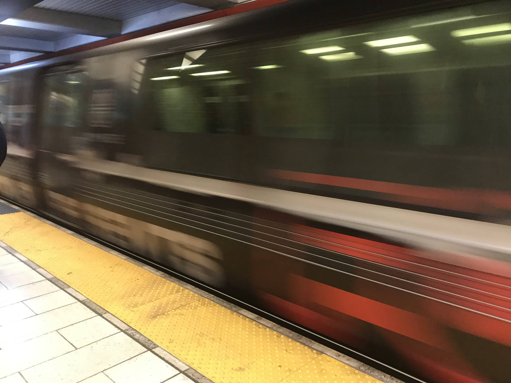
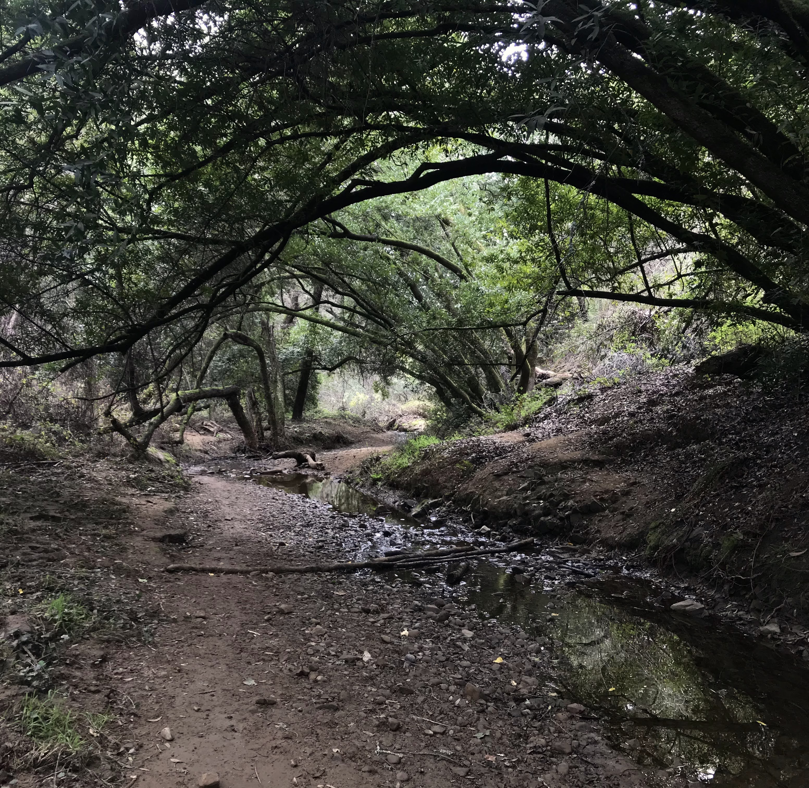
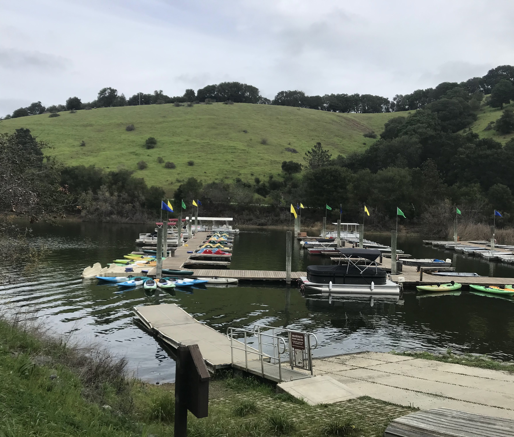

**Distance**: 29.7 miles 
**Elevation**: +4280 -4710 feet 
**Running time**: 4 hours 25 minutes 
**Transit time**: 30 minutes 
**Transit fare**: $2.70 + $3.20 = $5.90 
[View on GaiaGPS →](https://www.gaiagps.com/public/gfQjvaeNDKQ2ub5NrLWj158D)

Having only recently realized the possibility of not just running through East Bay parks but actually linking them up, this run represented an attempt to go big and see how many parks I could link up. I planned to start with the EBMUD De Laveaga watershed trail, then proceed to Sibley, Huckleberry, Redwood, and finally Anthony Chabot regionl parks.

Even though the heavily shaded trails remain quite runnable even in the warmest summer conditions the Bay Area sees, the route was long so that I decided to take advantage of cool winter temperatures and a nice marine fog. As usual, I packed up a small backpack with a few energy gels, a Clipper card, and a cell phone, and went for it.

## 12th Street Oakland

I got a pretty relaxed start and caught the BART at 7:50 AM. It was a dreary day, which I hoped meant I wouldn't need quite so much water.

## Orinda

The [De Laveaga](de-laveaga) trail starts just a quarter of a mile from the Orinda BART station, making it one of my favorite places to start a run.

Within two miles you've ascended nearly a thousand feet. The little eucalyptus grove at the top is one of my favorites. I've only run past, but it seems like an ideal spot to read a book.

I usually run in silence, but I tried on this run to listen to [Weapons of Math Destruction](https://www.penguinrandomhouse.com/books/241363/weapons-of-math-destruction-by-cathy-oneil/) by Cathy O'Neil. The book was alright, but by the time I got to about fifteen miles, I felt like I was missing out on the run.

## Sibley Volcanic Regional Preserve

One of Sibley's labyrinth's sits in the fog. The Bay Curious podcast has a lovely episode about [labyrinths in the Bay Area](https://www.kqed.org/news/11920627/labyrinths-everywhere-why-so-many-in-the-bay-area). They're often confused with mazes, but in fact they're designed to guide you; not cause you to lose your way.

## Huckleberry Botanic Regional Preserve

Something about Huckleberry Preserve makes it feel underrated, like it only connects larger, adjacent parks. But every time I run through it, the dark, sheltered valley is one of my favorite segments.

## Reinhardt Redwood Regional Park

Every time I get to the top of Redwood Peak, I think of the joke where someone drags their partner up a mountain, saying the whole way, "You won't believe the view! It's just a little farther, you won't believe the view!" Finally, they arrive at the top. "Can you believe the view? All the way up here and there's nothing to see!"

I took every opportunity in Redwood to take the least direct route. This was about the time that I put my headphones away so I could foucsed on my surroundings.

At risk of being a luddite, I appreciate that there's no cell service in the valley. It's not that I mind cell service, but it does make ethe park feel that much more remote, despite it's proximity to Oakland.

## Anthony Chabot Regional Park

Anthony Chabot is a surprisingly long park which connects to Redwood. The MacDonald trail was alright, but frankly, by the time it descended into the valley, I was 21 miles into my run, the sun was rising in the sky, and I wasn't enjoying it nearly as much as the first half. Perhaps the ridge would have been a nicer run, but it would have sent me the long way around the lake.

After six miles straight through the park, I was very happy to arrive at Lake Chabot.

I slightly underestimated the distance around the lake and was growing pretty tired, which certainly may have contributed to a small wrong turn.

Anthony Chabot has one final segment across the highway, but even though the remainder of the route was downhill after this, I'd hit the point in the run where even the downhills didn't flow easily.

## Bay Fair

As with a distressing fraction of my run, I was completely spent after a hard thirty miles of trail running and very, very happy to be on the train home. I waited for ten minutes and caught the twenty minute ride back to Oakland.

## Lake Merritt

In the end, I was reasonably happy with a thirty mile trail run at 8:56 per mile. It was really quite a bit harder than I expected though, and the long segment through Anthony Chabot certainly didn't help. I think this was still the preferable direction—going south does indeed feel like going downhill—but maybe an earlier start would have been worthwhile. I'm consistently surprised just how many of my runs end with me completely gased as the midday temparatures—as mild as they are—climb.

My holy grail remains to run a longe rsegment of the ridge, from Richmod to Anthony Chabot, but this was enough for me and the celebratory bubble tea was one of the best I've had.

[Back]()
