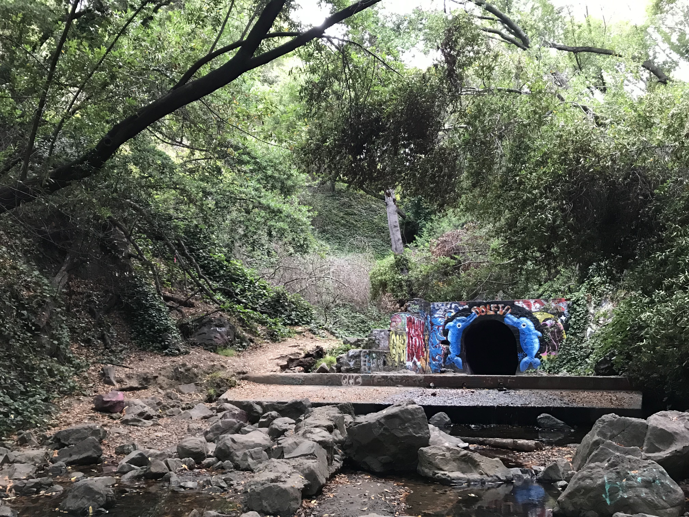
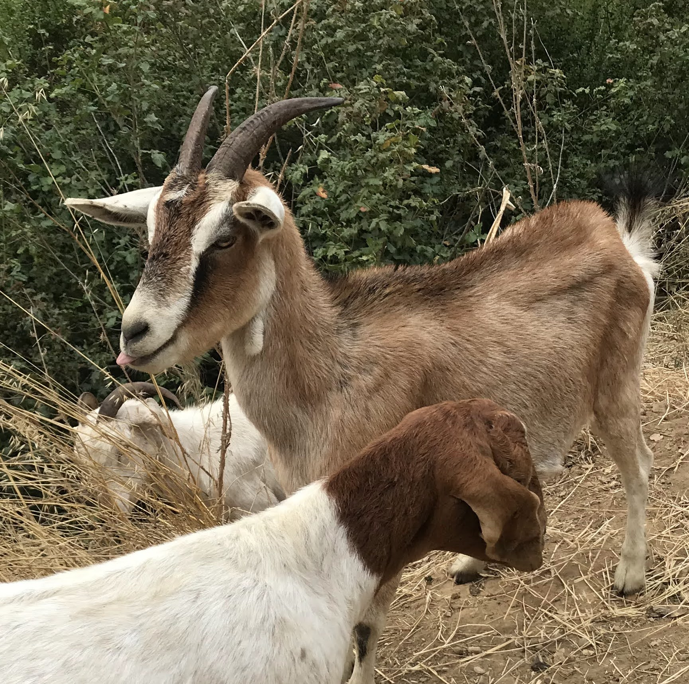

**Distance**: 19.3 miles
**Elevation**: +3500 -3500 feet
**Running time**: 3 hours 25 minutes
**Transit time**: 25 minutes
**Transit fare**: $5.00
[View on GaiaGPS →](https://www.gaiagps.com/datasummary/track/87de7066a08c66eacca4a78791d45001/)

Despite its relative proximity to Downtown Oakland, [Reinhardt Redwood Regional Park](https://www.ebparks.org/parks/reinhardt-redwood) was—before today—a park to which I had only ever driven or, twice, done a somewhat long run to only to arrive at the park in time to run a mile and head home.

I now realize this has been a huge loss on my part, as the 33 bus from Downtown Oakland cuts off a 3.5 mile approach in hardly ten minutes! Though it doesn't sound like much, that's seven miles out and back which can be replaced with trails! Let's go!

## Downtown Oakland

The moment I stepped onto the 33 bus, I exposed myself as a newbie. After unsuccesfully rubbing my Clipper Card all over the coin machine, the bus driver smiled and pointed to the card reader.

## Park Boulevard

The bus takes you 3.5 miles up the hill in hardly ten minutes, dropping you off on Park Boulevard along a string of local trail systems. While a perfectly fine destination in their own right, my favorite aspect is simply that they inject you into the parks with just over a mile of running and not more than a few steps on asphalt.

In a slight misstep though, I completely forgot where I had previously entered the trail system and, expecting to simply drop right onto a trail, instead found myself standing next to a bridge, looking down a steep slope to the trail a hundred feet below. It wasn't too bad to descend, but any reasonable [map like Gaia GPS](https://www.gaiagps.com/map/?loc=15.5/-122.2149/37.8097) will suggest a much more pleasant trailhead.

The running was only marginally better at the bottom of the ravine, although the trail—which is a somewhat charitable label for the boulder-strewn, half-dry creek bed—got me to my destination. The trail along the west side of the ravine turns out to be somewhat better, but then I'm a person who loves things that are neither actually trails nor actually "runnable."

The tunnel under Highway 13 is such a welcome alternative to the exit ramps and arterials which you'd otherwise have to cross to access the park.

## Palos Colorado Trail

The [Palos Colorado Trail](http://www.redwoodhikes.com/EastBay/JoaquinMiller.html) looks on the map like little more than a drainage ditch en route to better things, but it's really quite a stunning, redwood-lined little gorge. Judging by the foot traffic, there's no shortage of people who come here just for this section of the park.

## Joaquin Miller Park

As you climb out of the gorge, the valley floor drops away and you get your first real views. The protected valleys make it a fine run on a sunny day, but it only really shows off on a dim, foggy morning when the dewfall amounts to a light rain and the eucalyptus-lined hills disappear into the clouds.

Even the unnamed connector trails are lovely. I got lost here but didn't regret it too much.

## Reinhardt Redwood Regional Park

At 1619 feet above sea level, Redwood Peak amounts to little more than some boulders in a forest. In fact the whole park, to the best of my knowledge, offers hardly more than the slightest glimpse of any wide-angle vista.

The views of trees lost in fog are second to none though.

From Redwood Peak, the trail decends 800 feet to the Valley Trail. Although the trail is uncommonly flat, I prefer a somewhat contrived route which bounces between three parallel trails: the Valley Trail which follows the creek along the bottom of the valley, the French Trail which winds along halfway up the ridge, and the West Ridge Trail which follows the top of the ridge.

The next incline is the Chown Trail (which I [can only imagine](https://linux.die.net/man/1/chown) where the name came from). The steep incline and sharp switchbacks make you feel as if you're running in the treetops. If you bring a headlamp and run slightly after sunset, you may even catch the coyotes performing their evening howling.

The West Ridge Trail is a bit uneventful but on a nice foggy day still doesn't disappoint.

Passing the bathrooms, the playground, and a parking area at the far end of the park, the trail heads back up to the East Ridge Trail. The contrast is stark. Separated by hardly a half mile, the East Ridge Trail is arid and brushy.

My favorite views in the park is the West Ridge, seen on a foggy day from the East Ridge.

Fire prevention is rarely so cute.

The view before plunging back into the valley and back up onto the West Ridge.

Every trip into Redwood Regional must, inevitably, end with a climb back up out of the valley. It's painful no matter what, so I like to embrace it and take the somewhat more arduous section of the French Trail which adds a couple hundred additional feet of climbing.

Not quite high enough to penetrate the marine fog layer, the highest points in Redwood Regional most often just sit in the fog. Even as the sun burns away the fog though, the deep, shaded valleys permit you to skip the sunscreen.

The smell of eucalyptus is always a treat.

I was susprised to see as many people on the Palos Colorado Trail as in other sections of the park. Really, it's surprisingly lovely.

## Park Boulevard

The return bus was prompt and uncrowded. I've seen a car exit the highway onto Park Boulevard and blow through a red light, almost hitting a runner (the car didn't slow down or seem to mind), so I was very pleased to have spent my time on trails and be on the fast track back home.

## Downtown Oakland

Reinhardt Redwood Regional Park remains my favorite park in East Bay. The deep, redwood-lined valleys give it a mysterious, enchanting feeling not quite matched by any of the other parks I've explored.

I was exceptionally pleased with the bus as a means of accessing it. I really don't know why I avoided it for so long. It's easy to catch, uncrowded, and it quickly cuts off many of the most unpleasant miles. With easy access to [Huckleberry Preserve](https://www.ebparks.org/parks/huckleberry), [Tilden Regional Park](https://www.ebparks.org/parks/tilden), [Lake Chabot](https://www.ebparks.org/parks/lake-chabot), [San Leandro Creek Watershed](https://www.ebmud.com/recreation/east-bay/east-bay-trails) and more, Redwood Regional has always felt like the central hub of East Bay parks. The long approach from home or from the BART, however, has prevented it from serving as such. I'm excited to explore the point-to-point routes this new possibility opens up.

No matter how you get there, I can't recommend a visit highly enough.

[← Back]()
