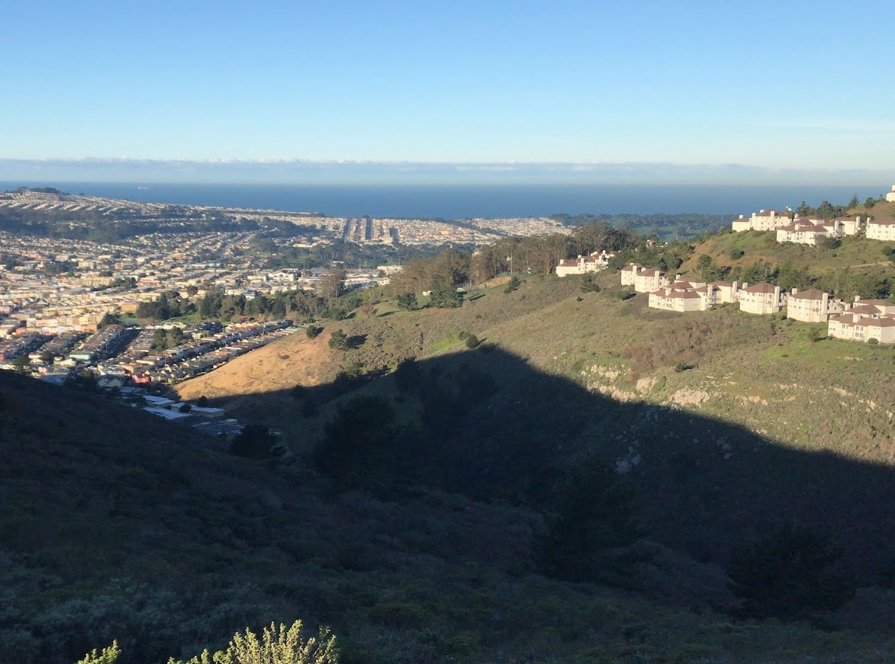

**Distance**: 16.8 miles
**Elevation**: +2250 -2250 feet
**Running time**: 2 hours 16 minutes
**Transit time**: 1 hour
**Transit fare**: $9.40
[View on GaiaGPS →](https://www.gaiagps.com/datasummary/track/381b4f4155cd89b1c5a460c90fb55b0c/)

If there's one hill that every visitor to San Francisco sees as they leave the airport, it's San Bruno Mountain. The only run at the time of writing for which I've crossed the bay, I really can't believe in hindsight that I put this run off for so long.

## 12th Street Oakland

The view of the port was a welcome change since I don't head to San Francisco too often these days.

## Daly City

I started my route at the Daly City BART station, though in hindsight the approach from Colma would have been a better choice with a shorter approach.

The run starts with a gently upward-sloping two mile approach. I imagined that somewhere along the approach I'd suddenly find myself looking at a stunning birds-eye view of San Francisco, but while perfectly fine, it wasn't really that kind of view.

I didn't expect the mountain to feel quite so separated from the city. I felt just a bit saddened to see such a beautiful little sanctuary with city encroaching so aggressively on all sides.

Bay Area weather is so monotonous that I was pleasantly surprised to see a layer of frost on everything.

The real fun starts three and a half miles into the run. At 600 feet of sustained climbing though, it's not actually as significant a climb as it appears from a distance.

The top of the ridge was really pretty close to what I hoped it'd be. I certainly didn't expect it would feel so isolated from the city of eight million people which surrounds it.

The ridge is really quite a perfect place to run.

The halfway point is a bit anti-climactic, as the trail simply steepens and fades as it approaches Highway 101. From what I can tell, there's really not much but to either slip and fall or find yourself lost in the brush, at which point it only makes sense to turn around.

Whether it was the gently rolling terrain or that I no longer had to expend energy figuring out where I was going, the return trip was lovely. My mind wandered, and the gently rolling miles ticked by pretty effortlessly. This segment made the trip worthwhile.

I didn't take many photos on the return trip. I zoned out and just enjoyed the running.

## Daly City

The trip home was simple, though I was tired.

## 12th Street Oakland

I've looked at this mountain so many times that I was thrilled it so completely lived up to my expectations. The only caveat is that it was quite a bit longer than I expected! The Daly City station was so close to the trails that I didn't expect it to take five miles to gain the top of the ridge!

In hindsight, I'd definitely instead recommend approaching San Bruno Mountain from the Colma BART station, which would have cut the overall run from seventeen miles down to twelve. If you don't traverse the entire length of the ridge, you can cut that down to eight or nine miles, and then we're in casual day-hike territory!

The point is, if you're like me and have ever looked longingly at San Bruno Mountain, I'd very highly recommend giving it a try. If you make slightly better choices than I did, it's very easily accessible from the BART and well within day hike range.

[← Back]()

